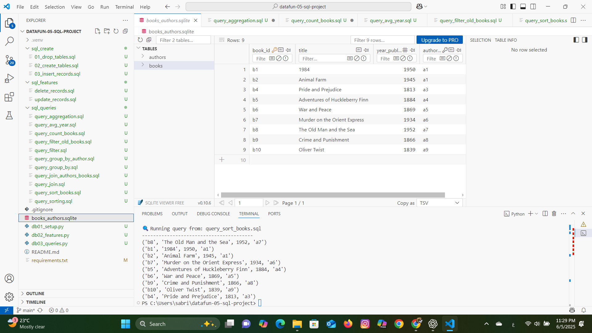

# 📚 datafun-05-sql-project

This project integrates **Python** and **SQL** using **SQLite**.  
It demonstrates schema design, data insertion, record updates, deletions, and SQL queries including filtering, aggregation, and joins.

---

## 🗂️ Project Structure

datafun-05-sql-project/
│
├── books_authors.sqlite # The SQLite database
├── sql_create/ # SQL scripts to create and populate database
│ ├── 01_drop_tables.sql
│ ├── 02_create_tables.sql
│ └── 03_insert_records.sql
├── sql_features/ # SQL scripts to update and delete records
│ ├── update_records.sql
│ └── delete_records.sql
├── sql_queries/ # SQL queries for analysis
│ ├── query_count_books.sql
│ ├── query_avg_year.sql
│ ├── query_filter_old_books.sql
│ ├── query_sort_books.sql
│ ├── query_group_by_author.sql
│ └── query_join_authors_books.sql
├── screenshots/ # Folder for screenshots used in this report
│ └── query_sort_books_result.png
├── db01_setup.py # Create database and insert records
├── db02_features.py # Update and delete records
├── db03_queries.py # Execute SQL query scripts
└── README.md # This file


---

##  Setup Instructions

### 1. Clone the repository
```bash
git clone https://github.com/sabrouch36/datafun-05-sql-project.git
cd datafun-05-sql-project

#2. Create and activate a virtual environment

python -m venv .venv
.venv\Scripts\activate       # For Windows
# OR
source .venv/bin/activate    # For macOS/Linux

##3. Install dependencies

pip install -r requirements.txt

##4. Run the scripts

python db01_setup.py       # Creates the database and inserts records
python db02_features.py    # Updates and deletes records
python db03_queries.py     # Runs analytical queries

## Database Schema
This project uses two related tables:

📘 authors
author_id (TEXT, Primary Key)

first

last

📗 books
book_id (TEXT, Primary Key)

title

year_published

author_id (Foreign Key to authors.author_id)

This schema reflects a one-to-many relationship:

One author can write multiple books

Each book is written by one author

## Features
SQL table creation with foreign keys

Data population using raw SQL

Update and delete records via SQL

SQL queries: filtering, sorting, aggregation, group by, and joins

Python integration using sqlite3 and pathlib

 Query Result: Sorted Books by Year


